# Setup Manatan
---

 Diunggah: 12 April 2026 – 'Yaaacha'

---
## **Persiapan**
Langkah-langkah persiapan sebelum menjalankan Manatan:

1. Unduh [Manatan](https://github.com/KolbyML/Manatan/releases)
	- Khusus pengguna Iphone, kamu harus mengunduh aplikasi Testflight melalui appstore terlebih dahulu.
	- Gunakan tautan ini untuk mengunduh Manatan: 
    ```bash
    https://testflight.apple.com/join/C2vh4SyT
    ```

2. Buat API Key Jimaku:
	- Buat akun di [Jimaku](https://jimaku.cc/account)
	- Buat API Key dengan menekan tombol `Generate` di bagian bawah pada menu `Account Setting`
	- Salin/simpan API Key untuk nanti dimasukkan ke kolom Jimaku API Key di aplikasi manatan
3. Unduh Kamus. Panduan pemilihan kamus dapat diakses di bagian [Kamus](#kamus)
	- Kamus JP-ID
		- [JIdict](https://drive.google.com/file/d/17t0_0sGi23GOFvEkulEOyu8eYT5Q3nQN/view?usp=drivesdk)
		- [JPdict](https://drive.google.com/file/d/11X1Wt5FRp7YnOXNHZIUmRapWZDxD5PPP/view)
	- Kamus JP-EN dan monolingual JP
		- [JMdict dan JMnedict](https://github.com/yomidevs/jmdict-yomitan?tab=readme-ov-file#jmdict-for-yomitan). Pilih yang JMdict_english.zip dan JMnedict.zip.
		- [Koleksi Marv](https://drive.google.com/drive/u/0/folders/1LXMIOoaWASIntlx1w08njNU005lS5lez)
		- [Koleksi Shoui](https://drive.google.com/drive/u/0/folders/16nPmTCQtpi43wkYdvTh7Qfngr21FE36W)
4. Pengaturan default Manatan menggunakan Note Type Kiku dalam pengaturannya. 
    Kamu bisa unduh [di sini](https://github.com/youyoumu/kiku/releases/latest). 
	Panduan penggunaan Kiku ada [di sini](https://kiku.youyoumu.my.id/installation.html). Kiku dibuat untuk bisa kompatibel dengan pengaturan Lapis, jadi kamu juga bisa menggunakan pengaturan Anki yang ada [Setup Anki](setup-anki-pc-lazy-guide.md).
### **Setup Awal**

1. Jalankan aplikasi Manatan yang sesuai dengan perangkat.
    
	??? info "Peringatan Saat Instal Pertama"
        === "MacOS"
		    Saat pertama kali menjalankan Manatan, akan muncul peringatan ini. Tekan done > buka `settings` > `privacy & security` > (scroll ke bawah) `open anyway` > `open anyway` > Selesai. Buka kembali Manatan seperti biasa
		   
	        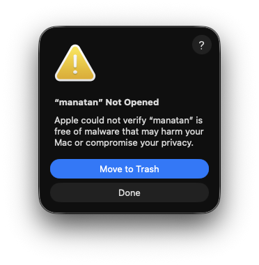{height=300 width=300}
 
    > Pertama kali Manatan diinstal/diluncurkan bisa memakan waktu sekitar 30 detik.

2. Saat pertama kali menjalankan aplikasi, pilih `I'm learning a language`
3. Plih Japanese
4. Masukkan API Key yang sudah disiapkan, jika kamu belum memiliki API Key Jimaku, dapatkan terlebih dahulu melalui:
	- Buat akun di [Jimaku](https://jimaku.cc/account)
	- Buat API Key dengan menekan tombol `Generate` di bagian bawah pada menu `Account Setting`
	- Salin API Key dan masukkan ke kolom Jimaku API Key di aplikasi manatan
5. Tekan Finish

### **Instal ekstensi**

1. Buka `Settings` > `Browse`
	- Pada Android dan Iphone, tekan tombol titik tiga di kanan bawah, lalu ke `Settings`> `Browse`
2. Salin URL repositori di bawah, lalu masukkan satu persatu URL repositori sesuai masing-masing kategori di pengaturan Manatan
        <table>
      <thead>
        <tr>
          <th style="text-align:left">Kategori</th>
          <th style="text-align:left; border-left: 1px solid var(--md-typeset-table-color)">Repositori Ekstensi (Pilih salah satu)</th>
        </tr>
      </thead>
      <tbody>
        <tr>
          <th colspan="2" style="text-align:center; border-top: 1px solid var(--md-typeset-table-color)">Manga</th>
        </tr>
        <tr>
          <td><b>Keiyoushi</b></td>
          <td style="border-left: 1px solid var(--md-typeset-table-color)"><a href="https://raw.githubusercontent.com/keiyoushi/extensions/repo/index.min.json">URL</a> **Recommended**</td>
        </tr>
        <tr>
          <td><b>Yuzono</b></td>
          <td style="border-left: 1px solid var(--md-typeset-table-color)"><a href="https://raw.githubusercontent.com/yuzono/manga-repo/repo/index.min.json">URL</a></td>
        </tr>
        <tr>
          <td><b>Kareadita</b></td>
          <td style="border-left: 1px solid var(--md-typeset-table-color)"><a href="https://raw.githubusercontent.com/Kareadita/tach-extension/repo/index.min.json">URL</a></td>
        </tr>
        <tr>
          <td><b>Aidoku Community</b></td>
          <td style="border-left: 1px solid var(--md-typeset-table-color)"><a href="https://aidoku-community.github.io/sources/index.min.json">URL</a></td>
        </tr>
        <tr>
          <td><b>Skittyblock Aidoku</b></td>
          <td style="border-left: 1px solid var(--md-typeset-table-color)"><a href="https://skittyblock.github.io/aidoku-community-sources/index.min.json">URL</a></td>
        </tr>
        <tr>
          <th colspan="2" style="text-align:center; border-top: 1px solid var(--md-typeset-table-color)">Anime</th>
        </tr>
        <tr>
          <td><b>Kohi-den</b></td>
          <td style="border-left: 1px solid var(--md-typeset-table-color)"><a href="https://kohiden.xyz/Kohi-den/extensions/raw/branch/main/index.min.json">URL</a> **Recommended**</td>
        </tr>
        <tr>
          <td><b>Yuzono</b></td>
          <td style="border-left: 1px solid var(--md-typeset-table-color)"><a href="https://raw.githubusercontent.com/yuzono/anime-repo/repo/index.min.json">URL</a></td>
        </tr>
      </tbody>
    </table>

3. Matikan `Show NSFW` jika kamu tidak ingin ada media NSFW muncul di pencarianmu
4. Kembali ke halaman utama

### **Tambah sumber**

1. Pergi ke **Browse**.
2. Buka **Video Extensions** / **Manga Extensions** dan instal ekstensi yang kamu butuhkan.
3. Buka **Anime Sources** / **Manga Sources**, pilih salah satu, lalu mulai browsing.
	- Untuk Anime, kamu perlu membuka salah satu **Source**/ web penyedia untuk dapat mencari anime yang kamu mau
	- Untuk Manga, kamu bisa langsung membuka **Manga Sources** dan menekan tombol `global search` di kanan atas untuk mencari judul manga yang ingin dibaca. Jangan lupa ganti opsi `pinned` ke `all` agar manatan dapat emncari dari semua penyedia yang sudah diinstal.
4. Setelah judul serial yang kamu cari muncul, pencet `Add to Library`

??? warning "Catatan keamanan" 
    repositori ekstensi seringkali disediakan oleh pihak ketiga. Silakan instal dari penyedia yang kamu percayai.

---
## **Penggunaan Media**

### **Manga**

1. Membaca dari sumber daring
	- Buka menu `Manga`
	- Buka judul serial lalu pilih chapter
2. Membaca dari berkas lokal.
	- [Manga Lokal](Setup-Manatan-manga-lokal.md)
=== "Manga Setting Layout"
	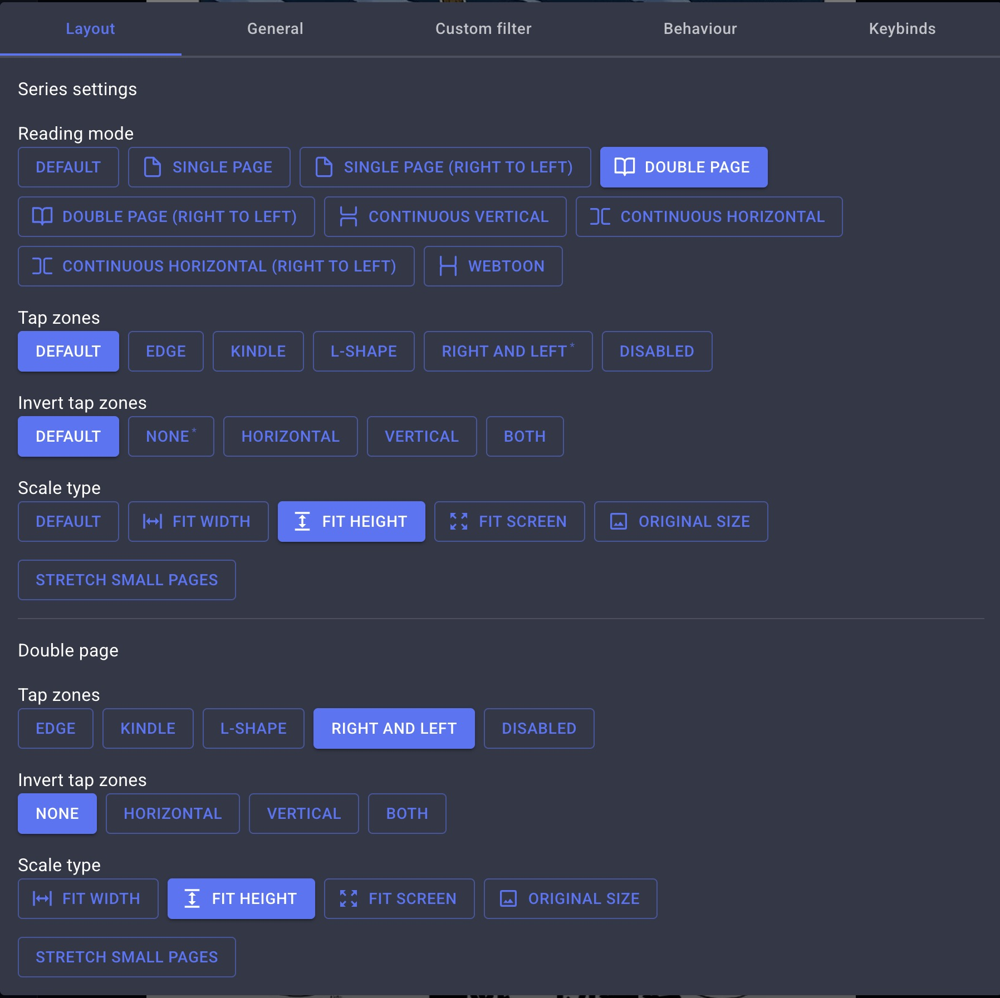{height=500 width=500}
=== "Manga Setting General"
	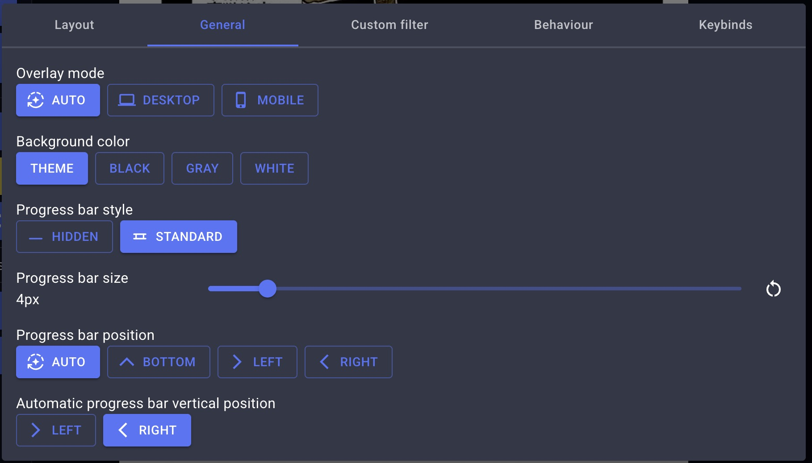{height=500 width=500}
=== "Manga Setting Custom Filter"
	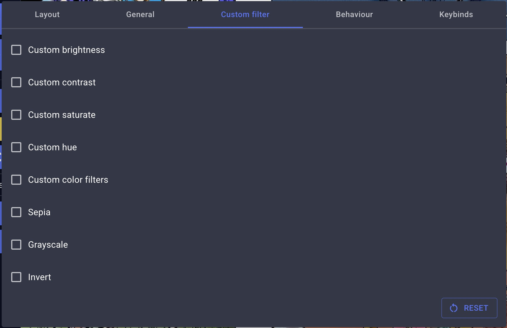{height=500 width=500}
=== "Manga Setting Behaviour"
	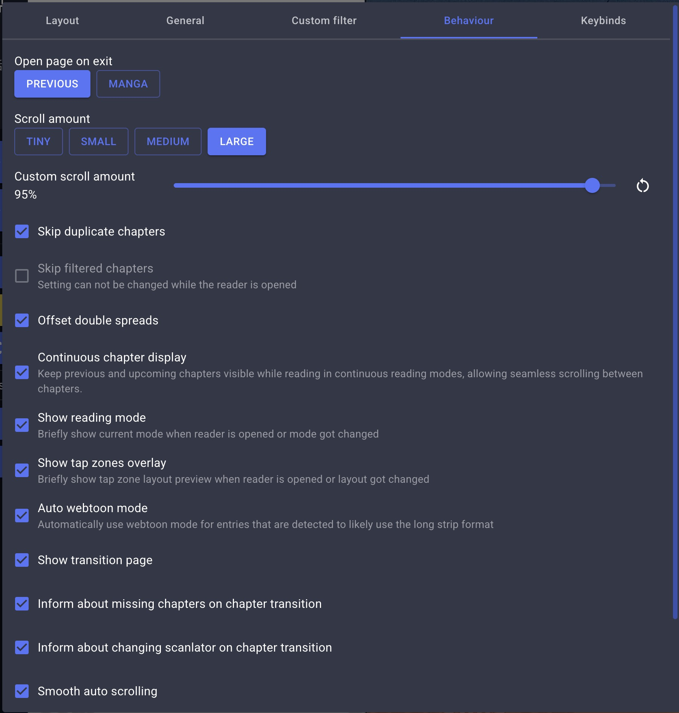{height=500 width=500}
=== "Manga Setting Keybinds"
	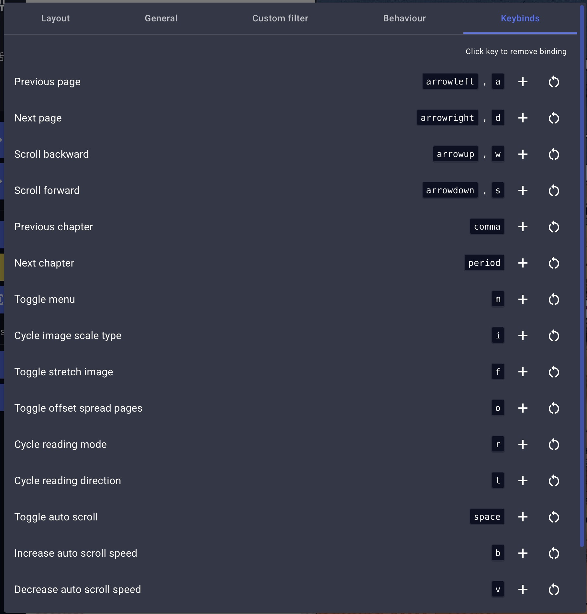{height=500 width=500}
	
### **Anime**

1. Menonton dari sumber daring
	- Buka menu `Video`
	- Buka judul serial lalu pilih episode
2. Menonton dari sumber berkas lokal
	- [Anime lokal](Setup-Manatan-anime-lokal.md)
3. Pengaturan Video Player
=== "Video Player Layout"
	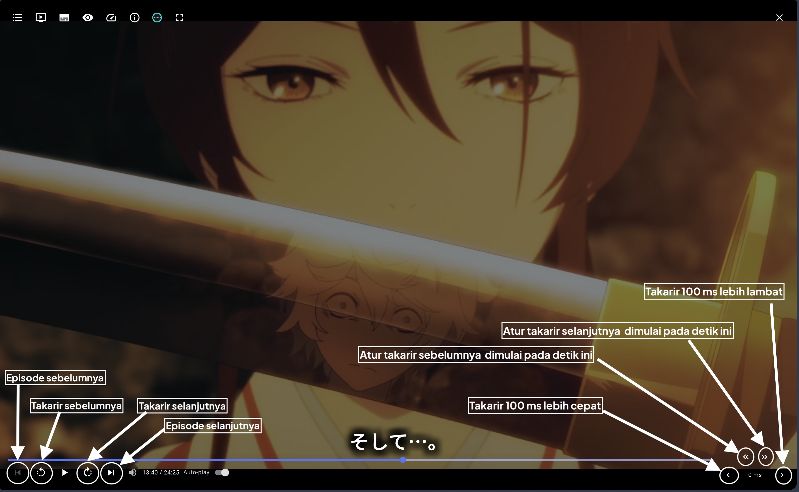{height=1000 width=600}
=== "Episode Selector"
	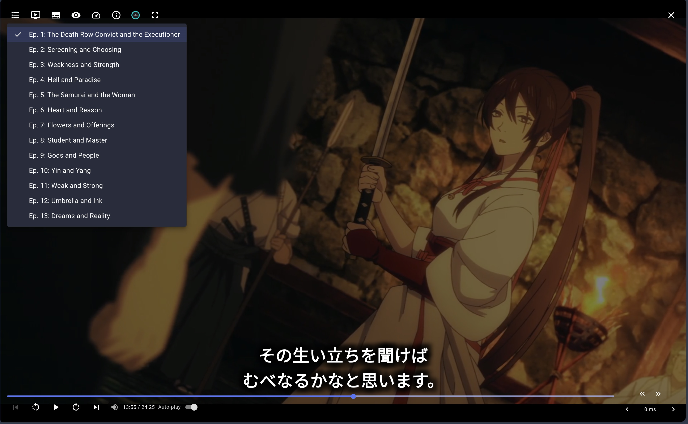{height=1000 width=600}
=== "Resolution Selector"
	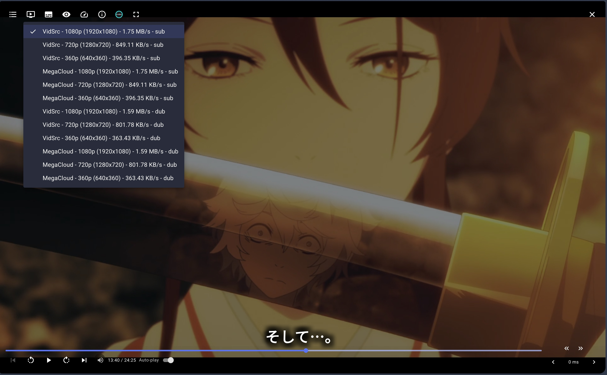{height=1000 width=600}
=== "Subtitle Selector"
	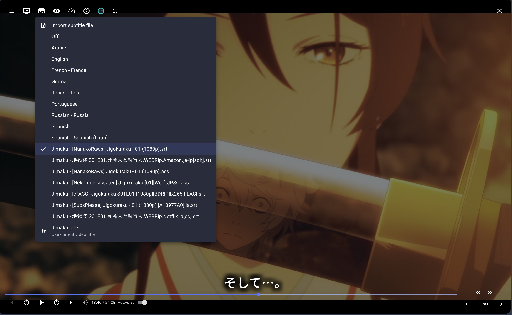{height=1000 width=600}
	
### **Novel (EPUB)**

Impor berkas EPUB dan baca.

- Next: [Novel (EPUB)](Setup-Manatan-novels.md)

---
## **Popup Dictionary**

### **Kamus**

Saat pertama kali menginstal Manatan, kamu perlu memuat kamus untuk menggunakan fitur popup dictionary.
File kamus berformat `.zip` dan **tidak perlu diekstrak**.

Kalau kamu tidak ingin punya terlalu banyak kamus, kamu bisa gunakan daftar yang ringkas

??? info "Daftar Ringkas oleh [Donkuri](https://donkuri.github.io/learn-japanese/setup/#what-if-i-dont-want-to-use-all-these-dictionaries): <small>(tekan sini)</small>"

	<ul>
	  <li>JMdict (atau Jitendex)</li>
	  <li>JMnedict</li>
	  <li>三省堂 8th Ed (or 明鏡 2nd Ed)</li>
	  <li>Kanji Jitenon</li>
	  <li>NHK2016</li>
	  <li>JPDB Frequency v2.2</li>
	</ul>

Di bawah ini Rekomendasi yang bisa kamu pilih. Bisa kamu campur atau ikutin semua, sesuai keinginanmu.

<details>
<summary><b>Daftar Rekomendasi <i>shoui</i> dari TMW TheMoeWay:</b> <i>(Tekan sini)</i></summary>
  Daftar lebih lengkap dan penjelasan lebih lanjut dari Shoui dapat kamu akses di web <a href="https://learnjapanese.moe/monolingual/#getting-and-using-monolingual-dictionaries">TheMoeWay</a>
<p><b>Bilingual</b></p>
<ul>
  <li>[Bilingual] JMdict Extra (Recommended).zip</li>
  <li>[Bilingual] 新和英.zip</li>
</ul>

<p><b>Frekuensi</b></p>
<ul>
  <li>[Freq] CC100.zip</li>
  <li>[Freq] JPDB (Recommended).zip</li>
</ul>

<p><b>Kanji</b></p>
<ul>
  <li>[Kanji] KANJIDIC (English) (Recommended).zip</li>
</ul>

<p><b>Monolingual</b></p>
<ul>
  <li>[Monolingual] 実用日本語表現辞典 (Recommended).zip</li>
  <li>[Monolingual, Encyclopedia] PixivLight.zip</li>
</ul>

<p><b>Grammar</b></p>
<ul>
  <li>[Grammar] Dictionary of Japanese Grammar 日本語文法辞典 (Recommended).zip</li>
  <li>[Grammar] どんなとき使う日本語表現文型辞典.zip</li>
  <li>[Grammar] 毎日のんびり日本語教師 (nihongosensei).zip</li>
  <li>[Grammar] JLPT文法解説まとめ(nihongo_kyoushi).zip</li>
  <li>[Grammar] 絵でわかる日本語.zip</li>
</ul>

<p><b>Nama</b></p>
<ul>
  <li>[Names] JMnedict.zip</li>
</ul>

<p><b>Pitch</b></p>
<ul>
  <li>[Pitch] アクセント辞典v2 (Recommended).zip</li>
</ul>

</details>

<details>
<summary><b>Daftar Rekomendasi <i>marv</i> dari Yomitan:</b> <i>(Tekan sini)</i></summary>

<p><b>Bilingual</b></p>
<ul>
  <li>[JA-EN] jitendex-yomichan</li>
  <li>[JA-EN] NEW 斎藤和英大辞典</li>
  <li>[JA-EN] 新和英</li>
</ul>

<p><b>Grammar</b></p>
<ul>
  <li>[JA Grammar] dojg-consolidated-v1_01</li>
</ul>

<p><b>Frekuensi</b></p>
<ul>
  <li>[JA Freq] JPDB_2022-05-10T03_27_02.930Z</li>
  <li>[JA Freq] Freq_CC100</li>
  <li>[JA Freq] BCCWJ-LUW</li>
</ul>

<p><b>Monolingual</b></p>
<ul>
  <li>[JA-JA] 実用日本語表現辞典</li>
  <li>[JA-JA] デジタル大辞泉</li>
  <li>[JA-JA Encyclopedia] Pixiv</li>
</ul>

<p><b>Kanji</b></p>
<ul>
  <li>[Kanji] KANJIDIC_english</li>
  <li>[Kanji] JPDB Kanji</li>
</ul>

<p><b>Pitch Accent</b></p>
<ul>
  <li>[Pitch] 大辞泉</li>
</ul>

</details>

<details>
<summary><b>Daftar Kamus yang kupasang:</b> <i>(Tekan sini)</i></summary>

<p><b>Kamus Bilingual</b></p>
<ul>
  <li>1. JIDict<br>   Kamus Jepang-Indonesia berbasis JMdict dan Sanseido, dikembangkan oleh tim Philia Space, fokus pada hasil yang mudah dipahami oleh pelajar bahasa Jepang di Indonesia.</li>
  <li>2. JMdict<br>   Kamus Jepang-Inggris utama dengan lebih dari 180.000 entri. Banyak dipakai sebagai sumber utama untuk kamus turunan lain. </li>
  <li>3. Jitendex.org<br>   Versi gabungan dari kamus bilingual JMdict, dengan tambahan fitur-fitur khusus dari situs Jitendex.org.</li>
  <li>4. 新和英<br>   Kamus Jepang-Inggris resmi dari Kenkyusha, menawarkan definisi yang lebih formal dan kontekstual dibanding JMdict.</li>
</ul>

<p><b>Proper Noun & Kanji Dictionary</b></p>
<ul>
  <li>5. JMnedict<br>   Kamus nama-nama orang, tempat, dan organisasi dalam bahasa Jepang. Berguna saat menemui nama khusus.</li>
  <li>6. KANJIDIC (English)<br>   Informasi karakter kanji dalam bahasa Inggris, termasuk makna, bacaan, stroke, dan level JLPT.</li>
  <li>7. 漢字源<br>   Kamus kanji berbahasa Jepang dengan penjelasan etimologi dan penggunaan historis. Lebih cocok untuk pembelajar lanjutan.</li>
  <li>8. weblio 古語辞典<br>   Kamus kosakata klasik Jepang. Membantu memahami bahasa kuno yang sering muncul dalam sastra dan sejarah.</li>
</ul>
<p><b>Monolingual – Kamus Besar & Onomatope</b></p>
<ul>
  <li>9. 旺文社国語辞典 第十一版<br> Kamus modern dengan definisi mudah dipahami, cocok untuk pelajar Jepang level menengah.</li>
  <li>10. 明鏡国語辞典 第三版<br> Menyediakan definisi dengan gaya penjelasan yang jernih dan mudah dibaca.</li>
  <li>11. デジタル大辞泉<br> Kamus komprehensif modern yang sering digunakan oleh penutur asli.</li>
  <li>12. 岩波国語辞典 第八版<br> Kamus yang terkenal dengan keakuratan dan gaya konservatifnya.</li>
  <li>13. 広辞苑 第七版<br> Salah satu kamus Jepang terbesar dan paling prestisius.</li>
  <li>14. 精選版 日本国語大辞典<br> Versi ringkas dari 日本国語大辞典, tetap komprehensif namun lebih praktis.</li>
  <li>15. ハイブリッド新辞林<br> Gabungan dari berbagai sumber, cepat dan ringan untuk pencarian harian.</li>
  <li>16. 新明解国語辞典 第八版<br> Dikenal karena penjelasan yang berani dan interpretatif.</li>
  <li>17. 三省堂国語辞典 第八版<br> Kamus ringkas namun mendalam, sangat cocok untuk pengguna intermediate.</li>
  <li>18. 例解学習国語辞典 第十一版<br> Kamus anak-anak yang sangat ramah pelajar asing.</li>
  <li>19. 新選国語辞典 第十版<br> Kamus ringkas untuk referensi cepat.</li>
  <li>20. 国語辞典オンライン<br> Versi daring ringan yang berisi banyak entri praktis.</li>
  <li>21. 実用日本語表現辞典<br> Fokus pada ekspresi praktis dan idiom.</li>
  <li>22. surasura 擬声語<br> Khusus kosakata onomatope, lengkap dengan contoh penggunaan dan makna.</li>
</ul>
<p><b>Kamus untuk Bunpou & Pelajaran:</b></p>
<ul>
  <li>23. 日本語文法辞典（全集）<br> Seri lengkap kamus grammar DoJG (Beginner–Advanced) dalam format searchable.</li>
  <li>24. JLPT文法解説まとめ<br> Ringkasan grammar JLPT dari berbagai sumber, mudah dinavigasi.</li>
  <li>25. 毎日のんびり日本語教師<br> Penjelasan grammar ringan dan jelas, dengan label level JLPT.</li>
  <li>26. 絵でわかる日本語<br> Kamus grammar berbasis ilustrasi, cocok untuk pemula dan visual learner.</li>
</ul>

<p><b>Kamus Pendukung (3 kanji atau lebih):</b></p>
<ul>
  <li>27. 学研 四字熟語辞典<br> Fokus pada idiom empat kanji, termasuk makna dan contoh penggunaan.</li>
  <li>28. 新明解四字熟語辞典<br> Alternatif dengan definisi yang unik dan gaya khas 新明解.</li>
</ul>

<p><b>Kamus Khusus (dialek–peribahasa–dan sejenisnya):</b></p>
<ul>
  <li>29. 故事ことわざの辞典<br>Berisi peribahasa dan ungkapan klasik Jepang.</li>
  <li>30. 故事・ことわざ・慣用句オンライン<br>Versi daring dari berbagai sumber idiomatik.</li>
  <li>31. ことわざ・慣用句の百科事典<br>Ensiklopedia idiom dan ungkapan tetap (set phrases).</li>
  <li>32. 全国方言辞典<br>Kamus dialek dari berbagai daerah Jepang.</li>
</ul>

<p><b>Kamus JLPT, Frequency & Korpus:</b></p>
<ul>
  <li>33. JLPT<br>Kumpulan kosakata JLPT level N1–N5.</li>
  <li>34. CC100<br>Korpus bahasa Jepang yang digunakan untuk analisis frekuensi kata.</li>
  <li>35. JPDB<br>Frekuensi kosakata dari database JPDB.</li>
  <li>36. Youtube<br>Frekuensi kata berdasarkan subtitle video YouTube Jepang.</li>
  <li>37. BcCWJ<br>Balanced corpus of contemporary written Japanese (BCCWJ).</li>
  <li>38. PixivLight<br>Frekuensi kosakata dari karya buatan pengguna di Pixiv.</li>
</ul>

<p><b>Kamus Pitch Accent:</b></p>
<ul>
  <li>39. 大辞林第四版<br>Selain kamus besar, versi ini menyertakan informasi pitch accent.</li>
  <li>40. 三省堂国語辞典第八番 (pitch)<br>Tambahan aksen dari 三省堂 untuk entri tertentu.</li>
  <li>41. 新明解第八版 (pitch)<br>Informasi pitch berdasarkan edisi 新明解 ke-8.</li>
  <li>42. 大辞泉 (pitch)<br>Pitch accent versi tambahan untuk entri 大辞泉.</li>
  <li>43. アクセント辞典<br>Kamus aksen khusus untuk penutur asli dan pembelajar tingkat lanjut.</li>
  <li>44. NHK 日本語発音アクセント新辞典<br>Standar referensi aksen NHK untuk kata-kata Jepang modern.</li>
  <li>45. NHK (pitch)<br>Tambahan pitch untuk entri berdasarkan standar NHK.</li>
</ul>

</details>

### **Rekomendasi Kamus Frekuensi**

Manatan mendukung penggunaan **kamus frekuensi** yang menunjukkan seberapa umum sebuah kata digunakan.

<b>JPDB</b>
Merupakan daftar frekuensi yang diambil dari [jpdb.io](https://jpdb.io), sebuah situs yang menganalisis banyak *light novel*, *visual novel*, anime, dan *J-drama*. Jadi, daftar ini merefleksikan seberapa sering kata muncul dalam media fiksi berbahasa Jepang.

<b>CC100</b>
Merupakan daftar frekuensi dari data korpus internet Jepang. Kata-kata formal akan tampak lebih umum dalam daftar ini.  
Contoh: 審議会 (*council*) memiliki peringkat ke-9733 di CC100, tetapi ke-58730 di JPDB.

<b>Apa yang dimaksud dengan "kata umum"?</b>

- **Sangat umum:** 1–10.000
- **Umum:** 10.001–20.000
- **Cukup umum:** 20.001–30.000
- **Agak jarang:** 30.001–40.000
- **Jarang:** 40.001–50.000
- **Sangat jarang:** 50.001–80.000
- **Tingkat yang mungkin tidak dikenal penutur asli:** 80.000+

### **Pengaturan Popup Dictionary**

Pengaturan Popup Dictionary Manatan dapat diakses melalui icon Manatan Settings  { width="20" valign="middle" }  yang ada di berbagai tempat di aplikasi manatan, seperti, di menu utama, di bagian atas tampilan video player, manga reader, dan epub reader.

Secara umum, kamu dapat mengikuti pengaturan yang ada di bawah ini. Selanjutnya, kamu dapat menyesuaikan  pengaturan-pengaturan lainnya sesuai dengan kenyamananmu sendiri.
=== "Pengaturan Popup 1"
	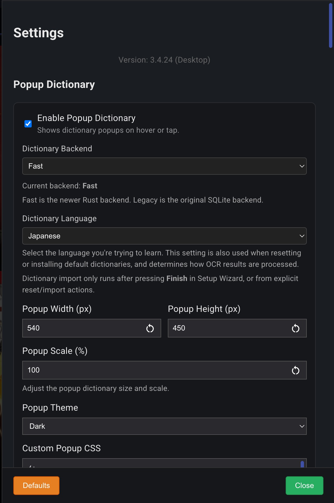{height=200 width=400}
=== "Pengaturan Popup 2"
	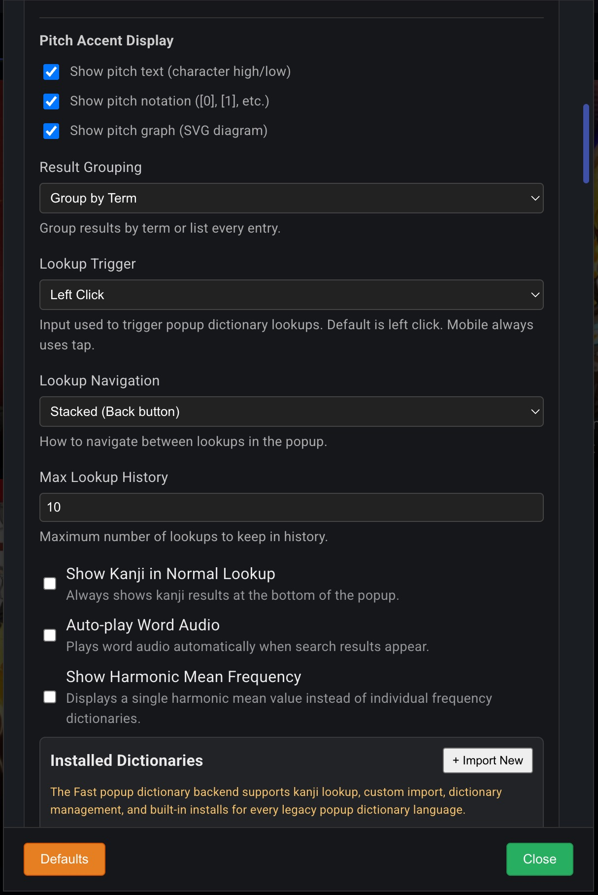{height=200 width=400}
=== "AnkiConnect 1"
	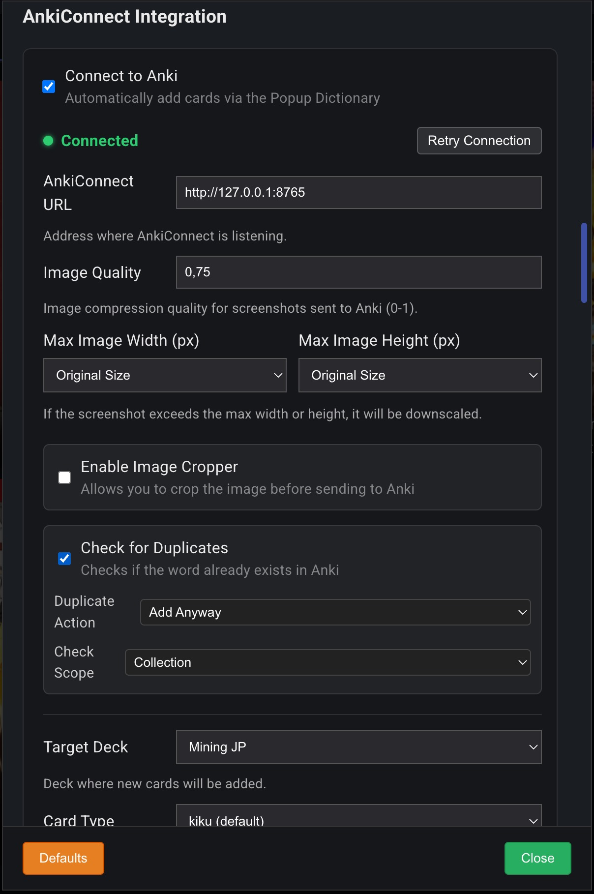{height=200 width=400}
=== "AnkiConnect 2"
	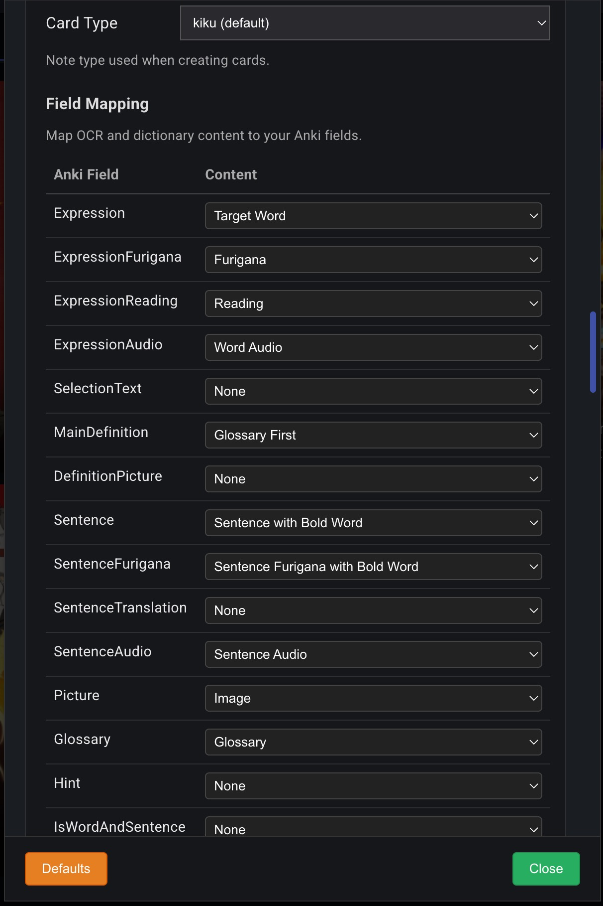{height=200 width=400}
=== "AnkiConnect 3"
	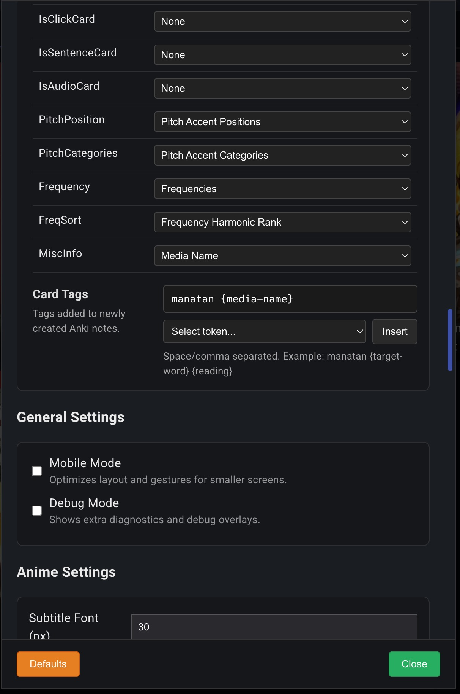{height=200 width=400}
=== "Anime Setting 1"
	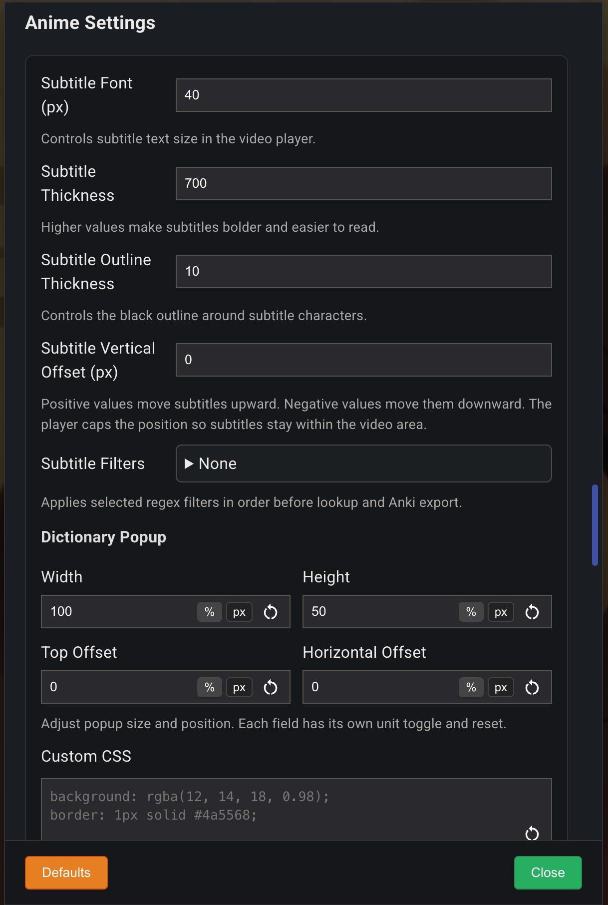{height=200 width=400}
=== "Anime Setting 2"
	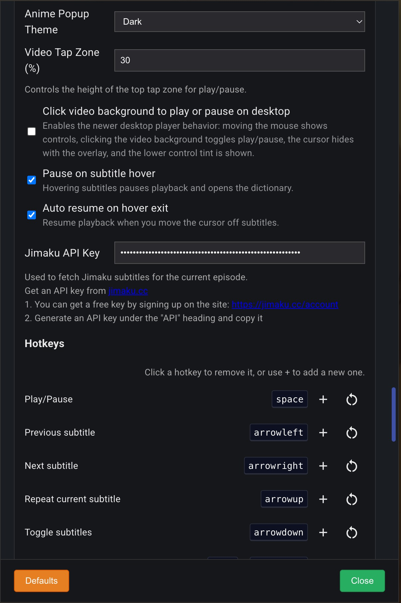{height=200 width=400}
=== "Anime Setting 3"
	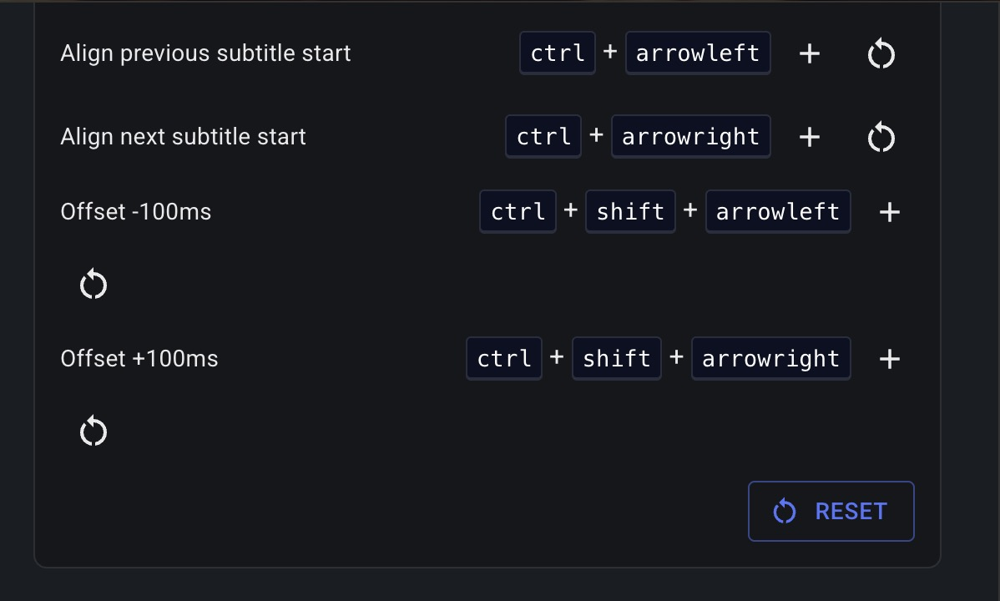{height=1000 width=600}
=== "Manga Setting 1"
	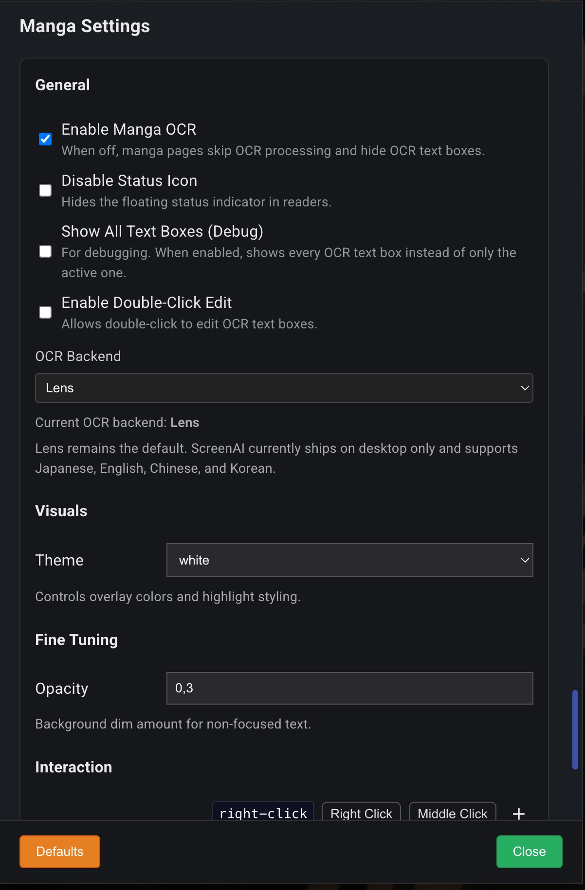{height=200 width=400}
=== "Manga Setting 2"
	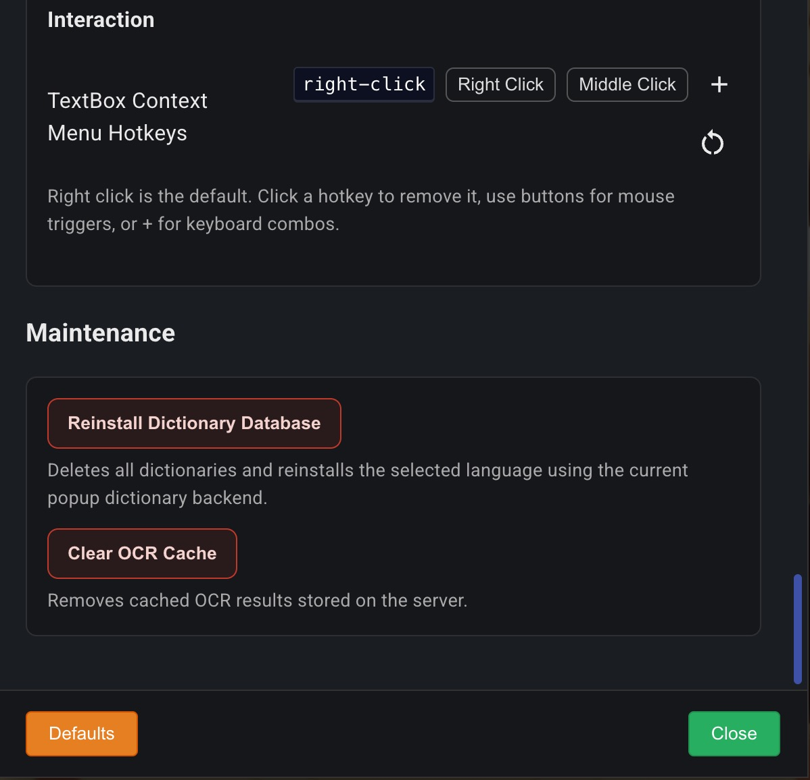{height=1000 width=600}

---

## **Info Tambahan dan Tips**

#### Info 1: Pembuatan Kategori

??? info "Penambahan kategori Anime dan Manga <small>(klik di sini)</small>"
    Kamu dapat membuat kategori dengan cara:
	    
		1. Tekan tombol `More`(Titik tiga di bawah)
	    2. Tekan "Edit Category Manga/Anime"

#### Info 2: Custom Popup CSS

??? info "Custom Popup CSS <small>(klik di sini)</small>"

    Manatan punya 2 pengaturan Custom Popup CSS. 1 yang berada di bagian Popup Dictionary dan 1 yang berada di Anime Settings.
	Sesuai deskripsi yang ada di kedua pengaturan tersebut, pengaturan ini tidak berlaku universal. Kamu bisa mendapatkan Custom CSS dengan masuk ke server [Discord Manatan](https://discord.gg/h9xJzTqjrZ)
    === "Manatan Popup CSS"
            Pengaturan ini berlaku untuk manga reader dan EPUB/Novel reader.
	    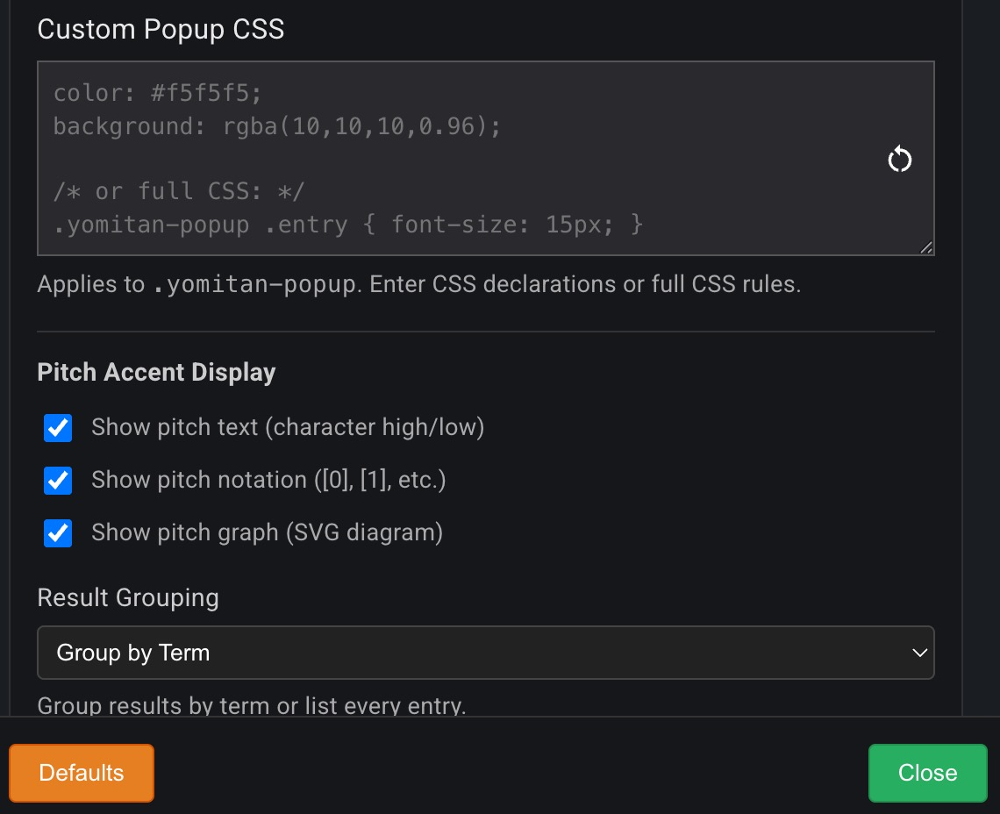{height=200 width=400}
    === "Manatan Anime Popup CSS"
	        Pengaturan ini berlaku untuk anime player.
		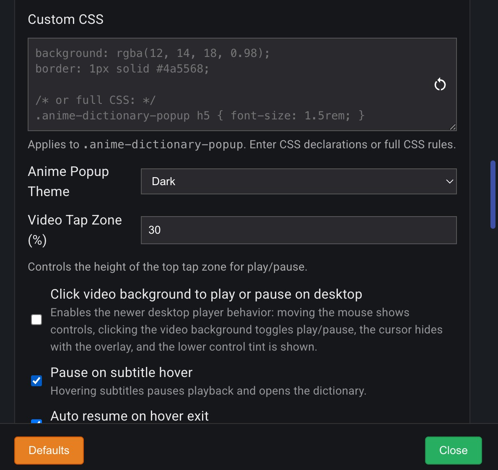{height=1000 width=600}
	
#### Tips 1: Penguraian kosakata yang lebih baik

??? tip "Penguraian kosakata yang lebih baik <small>(klik di sini)</small>"

    Jika Kamu menggunakan Yomitan, atur penghentian kalimat (sentence termination) ke mode kustom yang tidak memisahkan kalimat berdasarkan baris baru.

#### Tips 2: Media dalam bahasa lain

??? tip "Pencarian media dalam bahasa lain" <small>(klik di sini)</small>"
    Manatan juga bisa digunakan untuk membaca dan menonton anime dalam bahasa lain. Kamu bisa mengaksesnya dengan cara:
	1. Pergi ke menu `Browse`
	2. Tekan tombol 3 garis di atas kanan
	3. Pilih bahasa penyedia yang diinginkan
	Setelah mengaktifkan ini, setiap bahasa dan source dari bahasa tersebut yang sudah diaktifkan juga akan memunculkan hasil pencarian. Kamus yomitan dalam bahasa lain bisa kamu temukan [di sini](https://github.com/MarvNC/yomitan-dictionaries)
---

## **FAQs**

#### Pertanyaan 1: Source rekomendasi untuk Anime dan Manga?

??? question "Source mana saja yang direkomendasikan untuk sumber Anime dan Manga? <small>(klik di sini)</small>"

    - Anime
	    - Aniwatch (di kategori English>Aniyomi:Aniwatch)
	    - AnimePahe (di kategori English>Aniyomi:AnimePahe)
	- Untuk manga, sangat disarankan untuk menginstal sebanyak-banyaknya sumber anime, bahkan ekstensi dengan tag `18+` karena ketersediaan manga di masing-masing penyedia bisa sangat beragam, beberapa rekomendasi utama yang sudah diuji antara lain:
	    - MangaMura (memiliki tag 18+, tapi tidak semua isinya berupa manga 18+)
	    - Love4u (memiliki tag 18+, tapi tidak semua isinya berupa manga 18+)
		- Rawkuma (memiliki tag 18+, tapi tidak semua isinya berupa manga 18+)

#### Pertanyaan 2: Manga yang aku cari tidak ada, bagaimana mencarinya?
??? question "Manga yang aku cari tidak ada? Kenapa? <small>(klik di sini)</small>"
    Ketersediaan manga sangat bergantung penyedia ekstensi, untuk memudahkan pencarian, lakukan ini:
    - Aktifkan `Show NSFW` di pengaturan
	- Tambahkan source seperti MangaMura dan Rawkuma, atau lebih baik lagi instal semua daftar ekstensi yang ada di kategori 日本語
	- Kamu bisa membiarkan `Show NSFW` atau menonaktifkannya

#### Pertanyaan 3: Kapan kamus di-update? Harus update sendiri?

??? question "Kapan kamusnya di-update? Perlu update sendiri gak? <small>(klik di sini)</small>"

    - Aku jarang update; nggak perlu buru-buru ke versi terbaru karena isinya jarang berubah.  
	- Tapi kalau mau ngejar yang paling baru, bisa update sendiri tiap 4 bulan sekali.

## **Masalah Umum**

#### Masalah 1: Web UI tidak terbuka

??? warning "Web UI tidak keluar <small>(klik di sini)</small>"
    - Tunggu sekitar 30 detik pada peluncuran pertama, lalu muat ulang (refresh).
    - Buka `http://127.0.0.1:4568/` secara manual.
    - Di Windows, izinkan akses firewall jika diminta.
    - Restart Manatan jika port tampak sibuk.

#### Masalah 2: File lokal tidak muncul

??? warning "File lokal tidak muncul <small>(klik di sini)</small>"
    - Pastikan jalur folder lokal Anda sudah benar di pengaturan.
    - Pastikan struktur folder sesuai dengan panduan.
    - Segarkan (refresh) daftar setelah menambahkan file.

    Panduan:

    - [Manga lokal](/manga-lokal)
    - [Anime lokal](/anime-lokal)

#### Masalah 3: OCR atau pencarian kata terasa salah

??? warning "OCR atau pencarian kata terasa salah <small>(klik di sini)</small>"
    - Periksa pengaturan kamus/parsing.
    - Jika menggunakan Yomitan, terapkan rekomendasi parsing dari [tips](#tips-1-penguraian-kosakata-yang-lebih-baik).

#### Masalah 4: Subtitle hilang atau tidak sinkron

??? warning "Subtitle hilang atau tidak sinkron <small>(klik di sini)</small>"
    - Coba trek subtitle lainnya.
    - Sesuaikan waktu subtitle jika kontrol pemutar tersedia.
    - Untuk file lokal, verifikasi apakah subtitle tersedia di dalam file/kontainer tersebut.

#### Masalah 5: Reset total (Windows)

??? warning "Reset total (Windows) <small>(klik di sini)</small>"
    Jika diperlukan, hapus folder-folder ini dan luncurkan kembali:

    - `%LOCALAPPDATA%\Tachidesk`
    - `%APPDATA%\manatan`
    - `%Temp%\Suwayomi*`
    - `%Temp%\Tachidesk*`

    Hapus juga data situs/cookie untuk `127.0.0.1` di browser Anda.

#### Masalah 6: Masih bingung?

??? warning "Masih bingung? <small>(klik di sini)</small>"
    Tanyakan di Discord dan sertakan platform + apa yang Anda harapkan + apa yang sebenarnya terjadi.

    - [Bergabung ke Discord](https://discord.gg/tDAtpPN8KK)